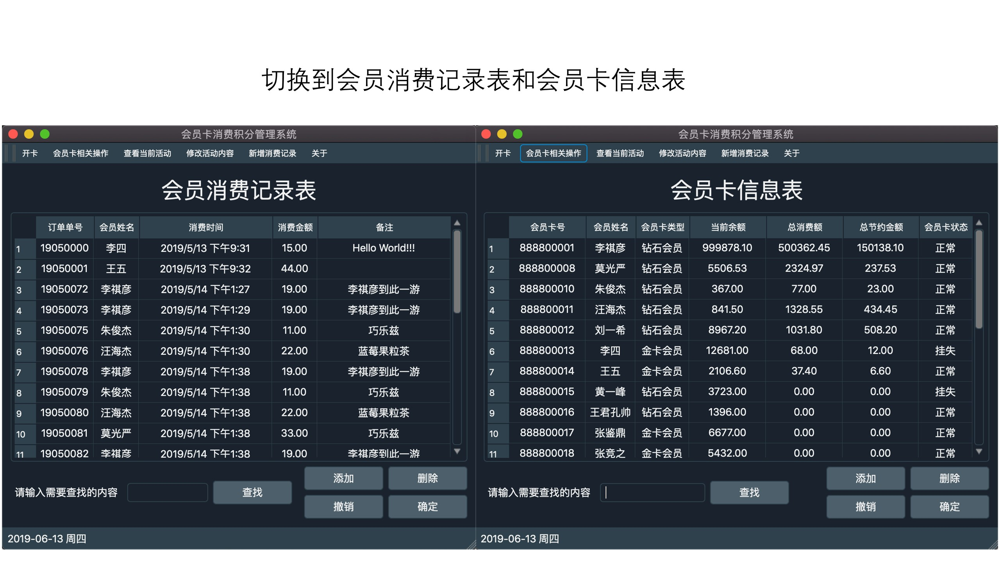

#会员卡消费积分管理系统
高级语言程序设计实验大作业  
环境:Qt5.12 + MySQL8.0  
源代码:membercard文件夹下, .h .cpp .ui文件  
运行效果:screenshot文件夹下    

##基本要求
1)	会员开卡：新建会员卡，记录所属顾客的有关信息  
2)	消费积分：会员每次消费时，累计会员积分  
3)	消费折扣优惠：会员消费时，根据积分值等级获得折扣  
4)	查询：查询会员信息、消费积分、累计折扣金额等  
5)	会员退卡：删除会员卡记录  

##扩展功能
1)	会员卡挂失、冻结、修改密码  
2)	查看和修改折扣优惠  
3)	设置会员的等级  
4)	查询：全局搜索  
5)  3个不同表格的切换显示  

##运行效果

